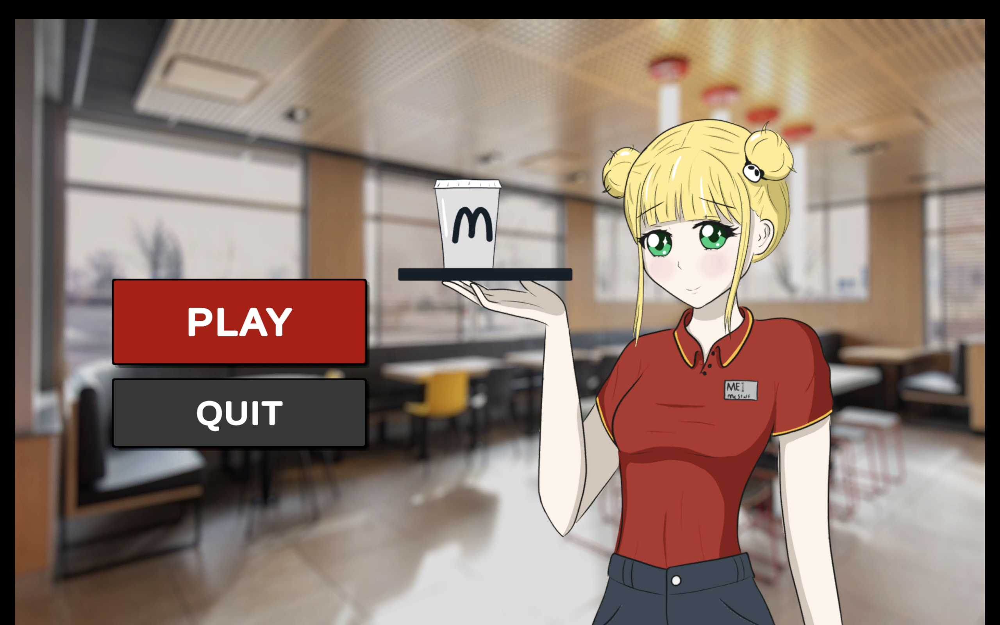

# Mc Dream

Mc Dream is a cooking simulation game developed using Unity as part of my Bachelor of Science thesis at the University of Debrecen. 
The main message of the game is to show the job hunting challenges and frustrations for a computer science students.

## Story

You play as a computer science student named Lia, who is a positive person, but she is frustrated about future of computer science and job market for her field.

### Features
- **Intuitive Controls:** Easy-to-learn controls for a smooth gaming experience.
- **Variety of Recipes:** A wide range of dishes to prepare, each with unique ingredients and cooking processes.

## Screenshots


*Main menu of Mc Dream.*


*In-game cooking interface.*


*Customer feedback and order completion screen.*

## Installation

1. **Clone the Repository:**
   ```sh
   git clone https://github.com/yourusername/mcdream.git
